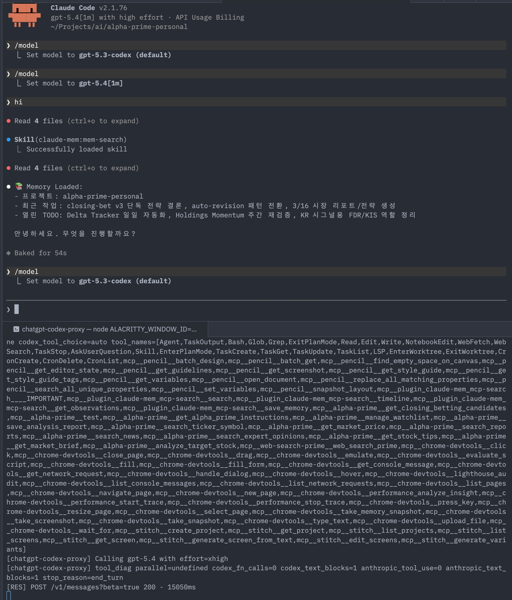

# ChatGPT Codex Proxy

> Claude Code를 ChatGPT Codex API와 함께 사용할 수 있게 해주는 Anthropic 호환 프록시 서버

- [English README](./README.md)

## 개요

이 프로젝트는 Anthropic API 호환 엔드포인트를 제공하여, Claude Code가 ChatGPT의 Codex API를 "네이티브 Claude"처럼 사용할 수 있게 합니다. `ANTHROPIC_BASE_URL`만 설정하면 바로 사용 가능합니다.

```
Claude Code                    chatgpt-codex-proxy              ChatGPT API
    │                               │                                │
    │  POST /v1/messages            │  POST /codex/responses         │
    │  (Anthropic 형식)             │  (Codex 형식)                  │
    │ ─────────────────────────────>│ ──────────────────────────────>│
    │                               │                                │
    │  Anthropic 응답               │  Codex SSE 응답                │
    │ <─────────────────────────────│<──────────────────────────────│
```

## 실행 예시

아래 화면은 이 프로젝트를 정상적으로 연결했을 때 Claude Code에서 볼 수 있는 예시입니다.



## 기능

- ✅ Anthropic Messages API 호환 (`/v1/messages`)
- ✅ OAuth 2.0 인증 (ChatGPT Plus/Pro 필요)
- ✅ 요청/응답 자동 변환
- ✅ SSE 스트리밍 지원
- ✅ Claude → GPT 모델 자동 매핑
- ✅ **MCP 툴 주입** — 시작 시 `~/.claude.json`을 읽어 MCP 서버에 연결하고, 스키마를 Codex 요청에 자동 주입

## 설치

```bash
# 저장소 클론
git clone https://github.com/your-username/chatgpt-codex-proxy.git
cd chatgpt-codex-proxy

# 의존성 설치
npm install

# 빌드
npm run build
```

## 사용법

### 1. 로그인

```bash
npm run login
```

브라우저가 열리고 ChatGPT 계정으로 로그인합니다. ChatGPT Plus 또는 Pro 구독이 필요합니다.

### 2. `.env` 설정

```bash
cp .env.example .env
```

`.env` 파일을 편집해 원하는 값을 설정합니다:

```env
# MCP 툴 주입: ~/.claude.json에 등록된 서버 이름(쉼표 구분) 또는 all
PROXY_MCP_SERVERS=stitch,linear
```

### 3. 서버 실행

```bash
# 개발 모드
npm run dev

# 프로덕션 모드
npm run start
```

### 4. Claude Code 설정

```bash
# 환경변수 설정
export ANTHROPIC_BASE_URL=http://localhost:19080
export ANTHROPIC_AUTH_TOKEN=your_chatgpt_oauth_token  # 또는 ANTHROPIC_API_KEY 사용
export ANTHROPIC_API_KEY="$ANTHROPIC_AUTH_TOKEN"        # 클라이언트 호환용

# Claude Code 실행
claude
```

## CLI 명령어

| 명령어 | 설명 |
|:---|:---|
| `npm run login` | OAuth 로그인 |
| `npm run logout` | 토큰 삭제 |
| `npm run status` | 인증 상태 확인 |
| `npm run dev` | 개발 서버 실행 (hot reload) |
| `npm run start` | 프로덕션 서버 실행 |

## MCP 툴 주입

Claude Code의 MCP 툴은 원래 Claude 백엔드에서만 사용할 수 있습니다. 이 프록시는 그 간극을 메웁니다. 시작 시 `~/.claude.json`을 읽어 MCP 서버에 연결하고, 툴 스키마를 수집해 모든 Codex 요청에 주입합니다. 그러면 GPT 모델도 MCP 툴을 호출할 수 있습니다.

```
Claude Code                 chatgpt-codex-proxy                  ChatGPT Codex API
   │                               │                                    │
   │  tools: [Edit, Bash, ...]     │  tools: [Edit, Bash, ...           │
   │  (deferred: stitch, qmd, ...) │          + mcp__stitch__*          │
   │                               │          + mcp__qmd__*  ]          │
   │ ─────────────────────────────>│ ──────────────────────────────────>│
```

### 설정 방법

`.env` 파일에서 `PROXY_MCP_SERVERS`를 설정합니다:

```env
# 특정 서버만 활성화 (이름은 ~/.claude.json의 키와 일치해야 함)
PROXY_MCP_SERVERS=stitch,linear

# ~/.claude.json에 등록된 모든 서버
PROXY_MCP_SERVERS=all

# 비활성화 (기본값)
PROXY_MCP_SERVERS=
```

서버 시작 시 다음과 같은 로그가 출력됩니다:
```
[mcp-registry] connecting to: stitch, linear
[mcp-registry] stitch: 8 tools loaded
[mcp-registry] linear: 6 tools loaded
[mcp-registry] ready: 14 total MCP tools
```

### 동작 방식

1. 시작 시 `~/.claude.json` → `mcpServers` 읽기
2. 활성 서버마다 MCP 핸드셰이크(`initialize` → `tools/list`) 실행 — HTTP와 stdio 모두 지원
3. 스키마를 프로세스 생명주기 동안 메모리에 캐싱
4. 매 `/v1/messages` 요청마다 캐시된 툴을 Codex `tools` 배열에 추가 (툴 이름: `mcp__서버명__툴명`)
5. GPT가 툴을 호출하면 Claude Code가 `tool_use` 응답을 받아 실제 MCP 호출을 수행하고, 결과를 프록시를 통해 되돌려 줌

HTTP(`type: http`)와 stdio(`command`) 방식 MCP 서버 모두 지원. 서버당 타임아웃은 20초.

## 모델 매핑

### 기본 매핑

| Claude 모델 | Codex 모델 |
|:---|:---|
| `claude-sonnet-4-20250514` | `gpt-5.2-codex` |
| `claude-3-5-sonnet-20241022` | `gpt-5.2-codex` |
| `claude-3-haiku-20240307` | `gpt-5.3-codex-spark` |
| `claude-3-opus-20240229` | `gpt-5.3-codex-xhigh` |
| 기본값 | `gpt-5.2-codex` |

### 사용 가능한 Codex 모델 목록

| 모델 | Effort | 비고 |
|:---|:---|:---|
| `gpt-5.4` | high | **현재 플래그십** (2026, gpt-5.2-codex 대체) |
| `gpt-5` | high | GPT-5 베이스 (effort 별도 지정) |
| `gpt-5-codex` | high | 에이전틱 코딩 특화 (공식 Responses API) |
| `gpt-5-codex-mini` | medium | 경량 GPT-5-Codex 변형 |
| `gpt-5.3-codex` | high | |
| `gpt-5.3-codex-xhigh` | xhigh | |
| `gpt-5.3-codex-medium` | medium | |
| `gpt-5.3-codex-low` | low | |
| `gpt-5.3-codex-spark` | low | 속도 최적화, >1000 tok/s |
| `gpt-5.2-codex` | high | 프록시 기본값 |
| `gpt-5.2-codex-xhigh` | xhigh | |
| `gpt-5.2-codex-medium` | medium | |
| `gpt-5.2-codex-low` | low | |
| `gpt-5.1-codex` | high | |
| `gpt-5.1-codex-max` | xhigh | |
| `gpt-5.1-codex-mini` | medium | |

단축 별칭: `gpt-5.4` → `gpt-5.4`, `gpt-5.3` → `gpt-5.3-codex`, `gpt-5.2` → `gpt-5.2-codex`, `gpt-5.1` → `gpt-5.1-codex`

### 커스텀 모델 매핑

환경변수로 Codex 모델을 직접 지정할 수 있습니다:

| 환경변수 | 설명 |
|:---|:---|
| `ANTHROPIC_DEFAULT_HAIKU_MODEL` | Haiku 계열 모델이 요청될 때 사용할 Codex 모델 |
| `ANTHROPIC_DEFAULT_SONNET_MODEL` | Sonnet 계열 모델이 요청될 때 사용할 Codex 모델 |
| `ANTHROPIC_DEFAULT_OPUS_MODEL` | Opus 계열 모델이 요청될 때 사용할 Codex 모델 |
| `PASSTHROUGH_MODE` | `true/1/yes/on`이면 요청 모델명을 그대로 Codex에 전달 |

**우선순위**: `PASSTHROUGH_MODE=true`면 passthrough, 아니면 환경변수 > 기본 매핑

예시:
```bash
# Haiku 요청에 gpt-5.3-codex-spark 사용
export ANTHROPIC_DEFAULT_HAIKU_MODEL="gpt-5.3-codex-spark"

# Sonnet 요청에 gpt-5.2-codex 사용
export ANTHROPIC_DEFAULT_SONNET_MODEL="gpt-5.2-codex"
```

### Effort 제어

Claude Code 모델 선택 UI의 effort 슬라이더(`Low ← → High`)는 **GPT 모델 사용 시 API 요청에 포함되지 않습니다.** Claude 네이티브 모델에서만 동작합니다.

Codex의 reasoning effort를 제어하려면 다음 두 가지 방법을 사용하세요:

**방법 1 — 모델명에 effort suffix 포함** (모델별 개별 제어에 권장)

```bash
# .zshrc
export ANTHROPIC_DEFAULT_SONNET_MODEL="gpt-5.3-codex-xhigh"   # xhigh
export ANTHROPIC_DEFAULT_HAIKU_MODEL="gpt-5.3-codex-spark"     # low
export ANTHROPIC_DEFAULT_OPUS_MODEL="gpt-5.2-codex"            # high (기본)
```

프록시가 모델명 suffix에서 effort를 자동 파싱합니다: `-xhigh` / `-high` / `-medium` / `-low` / `-spark`

**방법 2 — `.env`에서 전역 설정**

```env
PROXY_DEFAULT_EFFORT=high
```

우선순위 (높음 → 낮음): 요청의 `thinking.budget_tokens` → 모델명 suffix/테이블 → `PROXY_DEFAULT_EFFORT` → `medium`

### 쉘 함수로 쉽게 설정하기

`.zshrc` 또는 `.bashrc`에 함수를 등록하면 편리합니다:

```bash
# Claude Code + ChatGPT Codex proxy (simple mode)
# 서버는 수동으로 실행하고, gpt는 환경변수만 세팅합니다.
gpt() {
  emulate -L zsh

  local proxy_port="${CHATGPT_CODEX_PROXY_PORT:-19080}"
  local token="${ANTHROPIC_AUTH_TOKEN:-${ANTHROPIC_API_KEY:-dummy}}"

  export ANTHROPIC_BASE_URL="http://127.0.0.1:${proxy_port}"
  export ANTHROPIC_AUTH_TOKEN="$token"
  export ANTHROPIC_API_KEY="${ANTHROPIC_API_KEY:-$token}"
  export API_TIMEOUT_MS="${API_TIMEOUT_MS:-90000}"
  export PASSTHROUGH_MODE="${PASSTHROUGH_MODE:-true}"
  unset CLAUDE_CONFIG_DIR

  echo "🚀 Using local Codex proxy on :${proxy_port}"
  claude "$@"
}
```

사용법:
```bash
# 현재 프로젝트 디렉토리에서 실행
gpt

# 포트 충돌 시 대안 포트 지정
CHATGPT_CODEX_PROXY_PORT=18080 gpt

# 매핑 모드를 강제하고 싶으면
PASSTHROUGH_MODE=false gpt

# 토큰 및 모델을 명시적으로 고정
ANTHROPIC_AUTH_TOKEN=... gpt
```

문제 대응 체크리스트:
- 프록시 기동 확인: `curl -fsS http://127.0.0.1:${CHATGPT_CODEX_PROXY_PORT:-19080}/health`
- 포트 충돌 확인: `lsof -tiTCP:${CHATGPT_CODEX_PROXY_PORT:-19080} -sTCP:LISTEN -nP`
- 요청 모델 그대로 전달(기본): `gpt --model gpt-5.2`
- 매핑 모드로 테스트: `PASSTHROUGH_MODE=false gpt --model gpt-5.2`
- 최근 로그: `tail -n 120 /tmp/chatgpt-codex-proxy.log`

툴 라운드트립 스모크 테스트:
- `python3 scripts/tool_calling_smoke.py --base-url http://127.0.0.1:19080 --model gpt-5.2`


## API 호환성

### 지원 기능

| 기능 | 지원 여부 | 비고 |
|:---|:---|:---|
| 기본 채팅 | ✅ | |
| 스트리밍 | ✅ | SSE |
| 멀티턴 대화 | ✅ | |
| 시스템 프롬프트 | ✅ | `instructions`로 매핑 |
| 이미지 입력 | ⚠️ | 제한적 |
| Tool Calling | ✅ | Anthropic tools/tool_choice/tool_result 브리징 지원 |
| Temperature | ❌ | Codex 미지원 |
| Max Tokens | ❌ | Codex 미지원 |

참고: Tool Calling은 백엔드(Codex/모델)가 function_call/function_call_output을 지원해야 정상 동작합니다.
참고: 이미지 입력은 Anthropic `image(base64)`를 Responses `input_image(data URL)`로 변환합니다.
참고: 멀티턴 변환 시 `user.text -> input_text`, `assistant.text -> output_text`로 role-aware 매핑합니다.

### 호환성 체크리스트 (권장)

- Messages + 멀티턴: 기본 질의 2턴 이상이 유지되는지 확인
- Streaming: `stream=true`에서 `message_start` -> `content_block_*` -> `message_stop` 순서 확인
- Tool Calling Roundtrip: `tools/tool_choice` -> `tool_use` -> `tool_result` 흐름 확인
- Tool Schema Safety: object schema에 `properties` 누락 시 프록시에서 자동 정규화되는지 확인
- Passthrough/Mapping 모드: `PASSTHROUGH_MODE=true/false` 각각에서 모델 라우팅 기대값 확인

### 엔드포인트

- `POST /v1/messages` - Anthropic Messages API
- `GET /health` - 헬스체크

## 프로젝트 구조

```
chatgpt-codex-proxy/
├── src/
│   ├── index.ts           # 진입점
│   ├── server.ts          # Express 서버
│   ├── cli.ts             # CLI 명령
│   ├── auth.ts            # OAuth 인증
│   ├── routes/
│   │   └── messages.ts    # /v1/messages 엔드포인트
│   ├── transformers/
│   │   ├── request.ts     # Anthropic → Codex 변환
│   │   └── response.ts    # Codex → Anthropic 변환
│   ├── codex/
│   │   ├── client.ts      # Codex API 클라이언트
│   │   └── models.ts      # 모델 매핑
│   ├── mcp/
│   │   ├── config.ts      # ~/.claude.json MCP 서버 설정 읽기
│   │   ├── client.ts      # HTTP + stdio MCP 클라이언트 (tools/list)
│   │   └── registry.ts    # 툴 스키마 캐시 (싱글턴)
│   ├── types/
│   │   └── anthropic.ts   # 타입 정의
│   └── utils/
│       └── errors.ts      # 에러 처리
├── .env.example           # 환경변수 참고 파일
├── package.json
├── tsconfig.json
└── README.md
```

## 환경변수

| 변수 | 기본값 | 설명 |
|:---|:---|:---|
| `PORT` | `19080` | 서버 포트 |
| `PROXY_JSON_LIMIT` | `20mb` | 이미지 포함 요청의 JSON 본문 제한 |
| `CODEX_BASE_URL` | `https://chatgpt.com/backend-api` | Codex API URL |
| `ANTHROPIC_DEFAULT_HAIKU_MODEL` | - | Haiku → Codex 모델 매핑 |
| `ANTHROPIC_DEFAULT_SONNET_MODEL` | - | Sonnet → Codex 모델 매핑 |
| `ANTHROPIC_DEFAULT_OPUS_MODEL` | - | Opus → Codex 모델 매핑 |
| `PASSTHROUGH_MODE` | `true` | 기본 passthrough, `false/0/no/off`면 매핑 모드 |
| `PROXY_DEFAULT_EFFORT` | _(자동)_ | Reasoning effort 오버라이드: `low` / `medium` / `high` / `xhigh`. 미설정 시 모델 테이블 → 이름 suffix → `medium` 순 결정 |
| `PROXY_MCP_SERVERS` | _(비활성)_ | 주입할 MCP 서버: `all` 또는 `~/.claude.json` 키 이름(쉼표 구분) |

## 🔒 보안

### ✅ 개인 로컬 사용 (권장)

이 프로젝트는 **개인의 로컬 머신에서만 사용하도록 설계**되었습니다.

```bash
# ✅ 안전한 사용법
npm run dev  # localhost:19080에서만 실행
export ANTHROPIC_BASE_URL=http://127.0.0.1:19080
claude  # 같은 머신의 Claude Code에서만 접근
```

### ⚠️ 프로덕션 배포 시 필수 조치

**GitHub에서 clone/fork하여 프로덕션 환경(서버, 클라우드, 네트워크)에 배포하려면 다음을 반드시 구현하세요:**

#### 1. 🔐 인증 추가 (필수)
```bash
# API 키 인증 구현 필요
export PROXY_API_KEY="your-secret-key-here"
# 요청 시 헤더에 추가: X-Proxy-API-Key: your-secret-key-here
```

#### 2. 🛡️ CORS 제한 (필수)
```bash
# 신뢰할 수 있는 도메인만 허용
export ALLOWED_ORIGINS="https://your-domain.com,http://localhost:3000"
```

#### 3. ⏱️ 레이트 제한 추가 (필수)
```bash
# 무제한 API 호출 방지
# express-rate-limit 라이브러리 필요
# 예: 분당 10개 요청으로 제한
```

#### 4. 📁 파일 권한 설정 (필수)
```bash
# 토큰 파일 권한 0600 (소유자만 읽기/쓰기)
chmod 600 ~/.chatgpt-codex-proxy/tokens.json
```

#### 5. 📊 모니터링 추가 (권장)
```bash
# 비정상적인 사용 패턴 모니터링
# 로깅 활성화
# 비용 추적
```

### 보안 정보

- 토큰은 `~/.chatgpt-codex-proxy/tokens.json`에 저장됩니다
- 토큰은 자동으로 갱신됩니다 (5분 버퍼)
- ChatGPT Plus/Pro 구독이 필요합니다

---

## 주의사항

- ✅ **개인용으로 설계됨** - 개인 로컬 머신에서만 사용하세요
- ❌ **프로덕션 배포 시 주의** - 위의 "프로덕션 배포 시 필수 조치" 참조
- ChatGPT 서비스 약관을 준수하세요
- 과도한 사용은 계정 제한을 받을 수 있습니다
- **공개 네트워크(0.0.0.0)에 바인드하지 마세요** - 127.0.0.1:19080만 사용

## 라이선스

MIT
